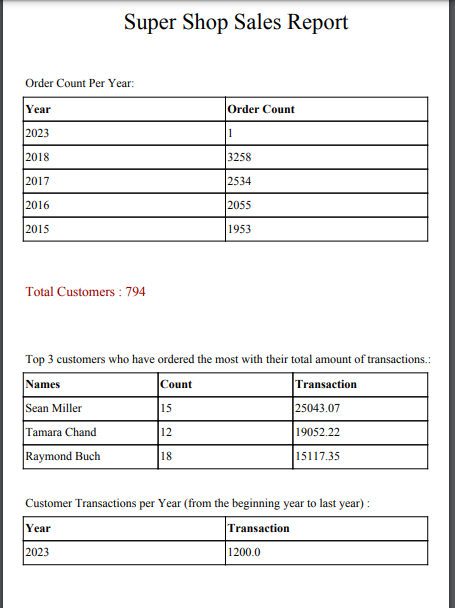
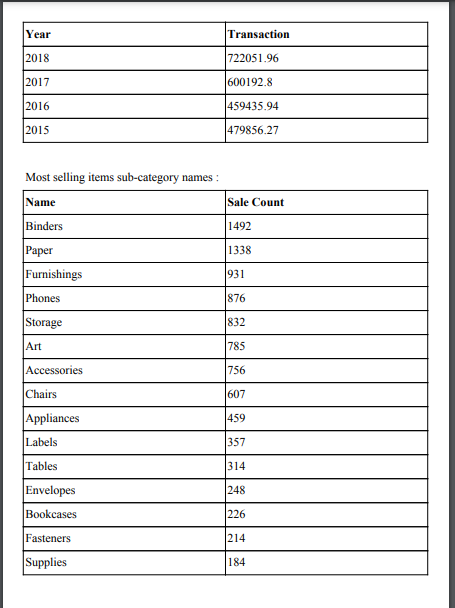
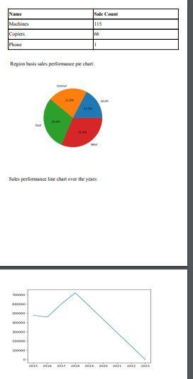

# Sales Reports

### Requirements
1. python3,
2.     pip3 install -r requirements.txt
### Task-1 :
1. ● Created an Entity for the user model using AbstractBaseUser class and a custom 
user manager using BaseUserManager
 
2. ● Now implement login and registration API with DRF
1.  `{{base_url}}/user/register/` 
   Required:   full_name,  email , ,password,   retype_password
2.  `{{base_url}}/user/login/` 
Required:  
email, password

### Task-2 :
1. ● Create a REST API for data insertion and manipulation
2. fetch & insert sales    `{{base_url}}/api/sales/`  
 Insert Required:
    order_id, 
ship_date, 
ship_mode, 
customer_id, 
customer_name, 
segment, 
country, 
city, 
state, 
postal_code, 
region, 
product_id, 
category, 
sub_category, 
product_name, 
sales, 
3.  update & delete sales   `{{base_url}}/api/sales/<pk>/` 
3. Generate Sales Report:  
`{{base_url}}/api/sales/report/`
  <b>you'll get a sales pdf file </b>

4. Created an API that will generate a PDF report from the given dataset. The report
include the below information:
 
○  Total number of orders count per year
 
○ Total count of distinct customers
 
○ Top 3 customers who have ordered the most with their total amount of
transactions.
 
○ Customer Transactions per Year (from the beginning year to last year)
 
○ Most selling items sub-category names
 
○ Region basis sales performance pie chart
 
○ Sales performance line chart over the years
 
1. Fully dynamic  Sales report . You can check by inserting & removing data

### Demo Images

 

### last step: 
1. You don't need to migration & migrate

2.     python3 manage.py runserver

3. If you want to access admin panel
then you use  `{{base_url}}/admin`

4.     
       email:admin@gmail.com
       password:123
### -----------Done------------
